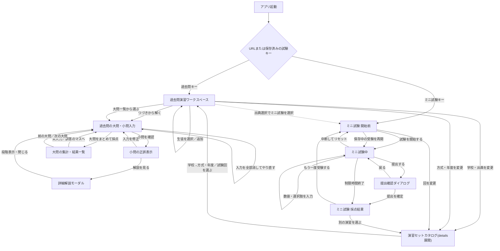
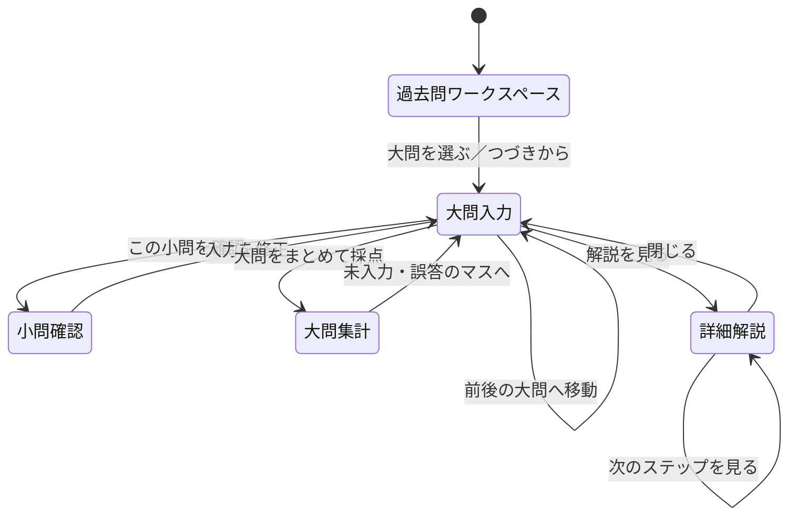
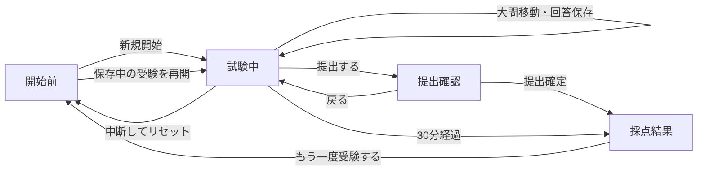
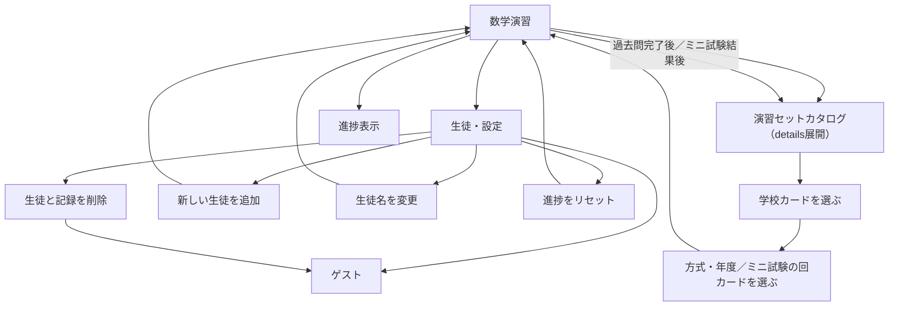

# 数学演習 画面遷移図

> 現行実装をもとにした画面・状態遷移の正本。アプリは単一ページで動作し、URL全体を遷移させるのではなく、過去問演習とミニ試験の表示領域を切り替える。

- 作成日：2026-07-29
- 対象：`math-practice`
- 起動ファイル：`index.html`
- 主な制御：`static/app.js`
- 公開URL：https://shtomi-tech.github.io/math-practice/
- 直接指定：`?exam=sougou` などの過去問キー、`?exam=mini_01` などのミニ試験キー

## 1. 全体の画面遷移

## 2. 画面・表示領域の一覧

| ID | 画面・表示状態 | 役割 | 主な入口 | 主な出口 |
|---|---|---|---|---|
| `PAST_HOME` | 過去問演習ワークスペース | 出典選択、大問一覧、進捗、問題、採点結果を一体表示する | 起動、出典変更、ミニ試験から戻る | 大問入力、解説、生徒・設定、出典変更 |
| `PAST_GROUP` | 過去問の大問・小問入力 | 数式の空欄を入力し、小問単位または大問単位で確認する | つづきから、大問一覧、前後の大問 | 小問結果、大問結果、解説、入力リセット |
| `SUB_RESULT` | 小問の正誤表示 | 小問ごとの正解・不正解・未確認を表示する | 小問確認、入力中の即時チェック | 入力修正、解説、大問結果 |
| `GROUP_RESULT` | 大問の集計・結果一覧 | 大問内の確認数、正答率を表示する | 大問採点 | 未入力・誤答箇所、大問移動 |
| `SOLUTION` | 詳細解説モーダル | 問題、答え、解説を表示する | 問題カード、大問結果一覧 | 問題カード |
| `MINI_INTRO` | ミニ試験開始前 | 試験の時間、配点、構成、対象単元、氏名を確認する | `?exam=mini_*`、回の変更 | 試験中、回の変更 |
| `MINI_EXAM` | ミニ試験中 | 制限時間内に数値入力・単一選択・複数選択で解答する | 試験開始、受験再開 | 提出確認、採点結果、リセット |
| `SUBMIT_DIALOG` | 提出確認ダイアログ | 未回答数を示し、提出を確定する | 提出する | 試験中、採点結果 |
| `MINI_RESULT` | ミニ試験採点結果 | 得点、各問の回答・正答・解説を表示する | 提出確定、時間切れ | 開始前、再受験、演習セットカタログ |

## 3. 過去問演習の状態遷移

### 過去問演習の完了単位

- 大問単位で進行するが、進捗の完了判定は小問単位で行う。
- 小問を正解すると、生徒・試験キー・大問番号・小問番号に対応する進捗へ保存される。
- 全体進捗は `完了小問数 / 全小問数` で表示される。
- 未入力の小問は「未入力のマスへ」、採点後の不正解は「誤答のマスへ」で移動できる。
- 過去問には独立した提出結果画面はない。大問の問題カードと右側の結果レールが、そのまま演習画面と結果表示を兼ねる。

## 4. ミニ試験の状態遷移

### ミニ試験の状態

| 状態 | 表示 | 保存されるもの | 次の状態 |
|---|---|---|---|
| `intro` | 試験開始前 | 期限内の保存受験があれば再開案内 | `active` |
| `active` | 試験中 | 回答、開始時刻、締切時刻、氏名 | `confirm`、`result`、`intro` |
| `confirm` | 提出確認 | 追加の状態は持たない | `active`、`result` |
| `result` | 採点結果 | 得点、各問の正誤、配点、回答、正答 | `intro` |

提出時は、試験中に正誤や解説を表示せず、提出または時間切れ後に初めて採点結果と解説を表示する。

## 5. 共通ナビゲーションと補助状態

- 通常URLでは、生徒、進捗、入力下書きを端末の `localStorage` に保存する。
- 生徒を選択しない場合はゲスト扱いとなり、進捗は保存されない。
- 生徒を選択すると、出典ごとの進捗と入力下書きが切り替わる。
- 生徒別共有URLでは、過去問の進捗・下書き・ミニ試験の受験状態・結果がクラウド保存対象になる。
- ミニ試験では、回ごとに受験状態と結果を分離する。
- source pickerは独立した画面遷移ではなく、問題画面上部で開閉する`details`パネルである。全11セットの状態を比較し、選択後は元の問題画面へ戻る。
- カタログの過去問セット状態は「未着手・学習中・完了」、ミニ試験セット状態は「未受験・保存中・受験済み」とする。現在大問は過去問が「未着手・入力中・学習中・完了」、ミニ試験中が「未回答・回答中・回答済み」である。

## 6. 主要な遷移条件

| 条件 | 遷移・表示 |
|---|---|
| URLに有効な `exam` がある | 指定された過去問またはミニ試験を初期表示する |
| URL指定がない | 保存済みの試験キー、なければ既定の過去問を表示する |
| 過去問の小問を正解する | 該当小問を完了として進捗に保存する |
| 過去問の回答を変更する | 該当小問の確認状態を解除し、再確認を要求する |
| ミニ試験で時間切れになる | 自動提出し、採点結果へ移動する |
| ミニ試験をリセットする | 保存中の回答とタイマーを削除し、開始前へ戻る |

## 7. 実装上の対応表

| 画面・状態 | 主な実装箇所 |
|---|---|
| 初期ルーティング、出典切替、過去問ワークスペース | `static/app.js` の `loadCurrentExam`、`setCurrentExam`、`render` |
| 大問・小問入力、進捗、採点 | `static/app.js` の `renderProblem`、`gradeSubProblem`、`gradeCurrent` |
| 詳細解説 | `static/app.js` の `openSolutionModal`、`renderSolutionModalBody` |
| ミニ試験開始前・試験中・結果 | `static/app.js` 内の `examFlow` |
| 演習セットカタログ、学校集計、大問Unit状態 | `static/app.js` の `catalogStateForExam`、`schoolCatalogSummary`、`renderGroups`、`renderExamGroupList` |
| 共通のHTML領域 | `index.html` |
| 問題・試験データ | `static/*-data.js`、`static/mini-data.js` |
